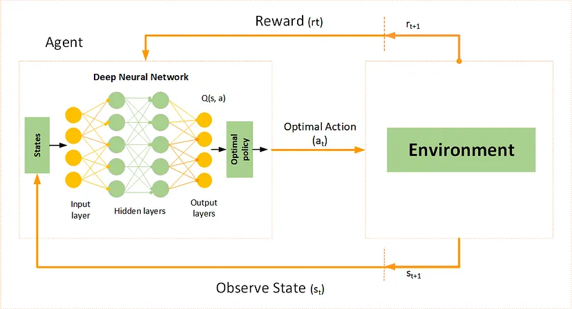
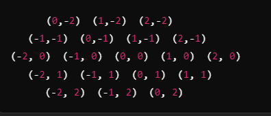

# Deep Q-Network 

The DQN algorithm follows a deep neural network-based approach to learn and optimize action-value functions. The working process can be summarized as follows:

1. **State Representation**: Convert the current state of the environment into a suitable numerical representation, such as raw pixel values or preprocessed features. (can be rings/coins...)
2. **Neural Network Architecture**: Design a deep neural network, typically a convolutional neural network (CNN), that takes the state as input and outputs action-values for each possible action.
3. **Experience Replay**: Store the agent’s experiences consisting of state, action, reward, and next state tuples in a replay memory buffer.
4. **Q-Learning Update**: Sample mini-batches of experiences from the replay memory to update the neural network weights. The update is performed using the loss function derived from the Bellman equation, which minimizes the discrepancy between the predicted and target action-values. 

    **The Bellman equation* is the basis of most reinforcement learning algorithms, including Q-learning. It describes how to estimate the quality of a state or action based on the current reward and possible future rewards. (If you're in any state s, performing an action 𝑎, and the game moves to a new state 𝑠′, you get the reward 𝑟)

5. **Exploration and Exploitation**: Balance exploration and exploitation by selecting actions either greedily based on the current policy or stochastically to encourage exploration.

6. **Target Network**: Use a separate target network with the same architecture as the main network to stabilize the learning process. Periodically update the target network by copying the weights from the main network.

7. **Repeat Steps 1 to 6**: Interact with the environment, gather experiences, update the network, and refine the policy iteratively until convergence.

## Example of rewards in a game
For example, in the game YINSH, you can set the following rules:

+1: if a move results in a successful chip flip.
+5: if a move results in a line of 5 counters.
-1: if the player made a useless move without flipping the chips.
+10: if the player wins.
-10: if the player loses.

## Coordinates in a hexagonal grid
For hexagonal games, a coordinate system with three axes, the axes (q, r, s), is often used. This is called an axial coordinate system (axial coordinates):

q  - "right" axis.
r - down-left axis.

Example of cell encoding:

## Movements in a hexagonal mesh
The moves in a hexagonal grid are described by six basic directions:

* Right: (+1,0)
* Left: (-1,0)
* Up-right: (0,-1)
* Up-left: (-1,+1)
* Down-right: (+1,-1)
* Down-left:  (0,+1)